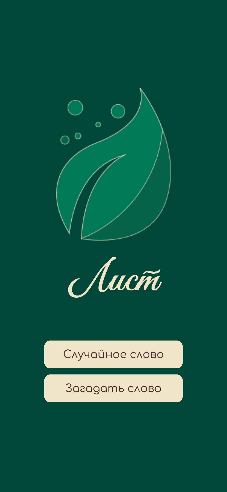
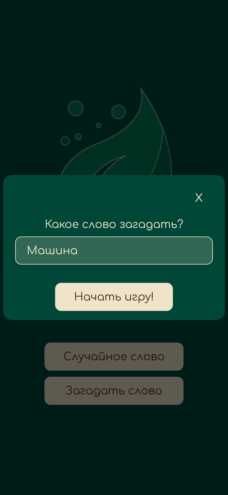
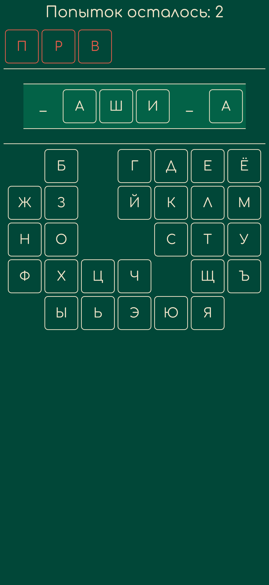
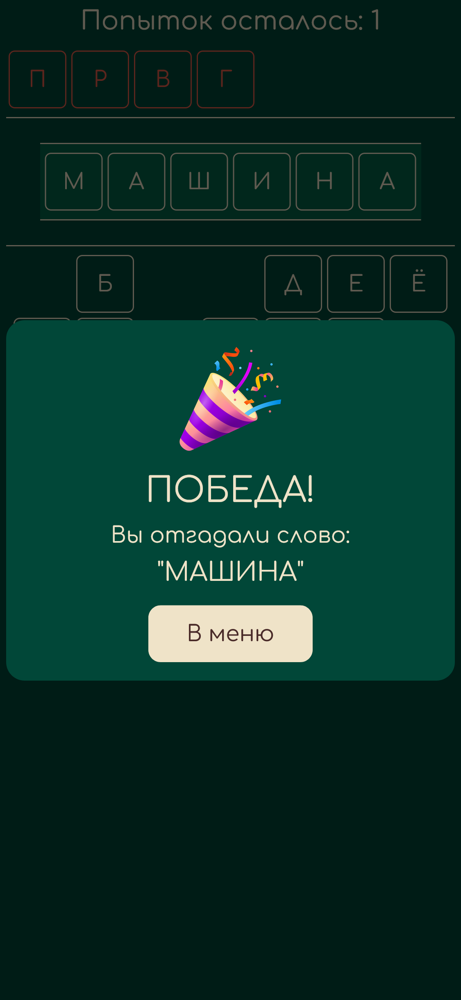
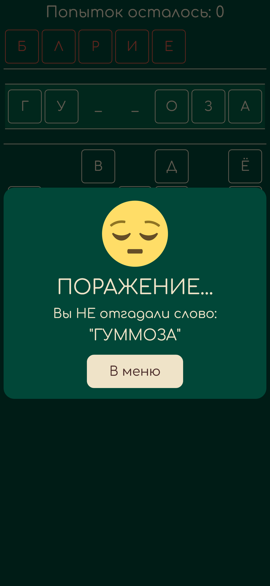

# "Первая буква "Л", последняя "Т" — ЛИСТ!" © Аринка
Приложение доступно по ссылке: https://edgefirewalk.github.io/leaf

 

  

## Загадывайте слова и играйте с друзьями

Отличный вариант для вашего нескучного времяпровождения!

 

  
  
  

## Расширьте свой словарный запас

Внутренний словарь игры содержит более 64.000 слов! Хотя бы пару из низ, вы точно ещё не слышали)

 

  

